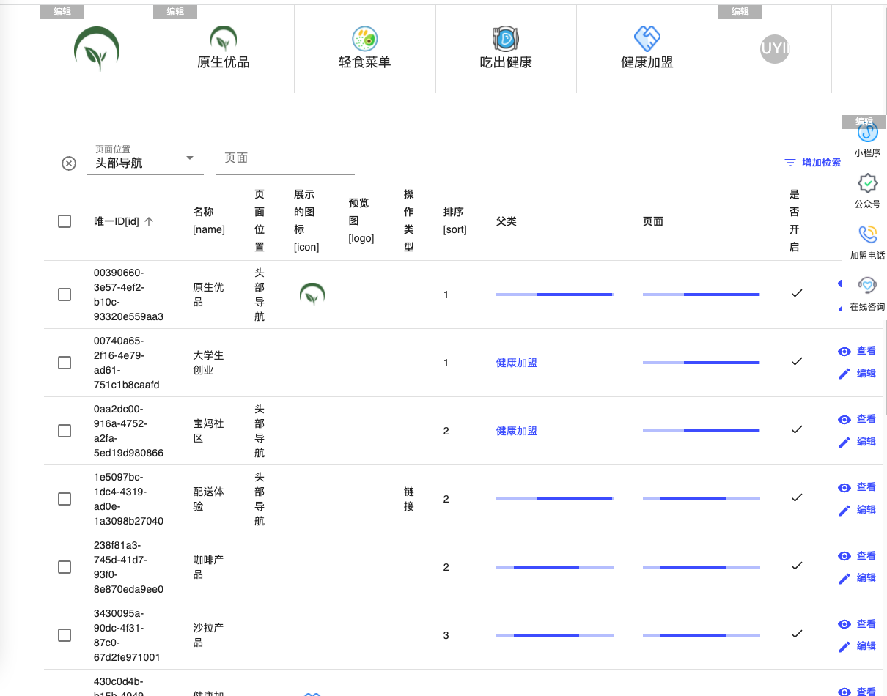

# Nextjs & Qiankun 实现官网

### 项目框架
- [nextjs](https://nextjs.org/)
- [qiankun](https://qiankun.umijs.org/)
- [swr](https://swr.vercel.app/zh-CN)
- [tailwindcss](https://www.tailwindcss.cn/docs)

- [iconfont](https://www.iconfont.cn/)

### 项目功能预览

#### PC 端样式

首页展示

首页可编辑

富文本页可编辑

导航配置页面

富文本配置页面

#### 移动端样式

首页

导航

新闻
