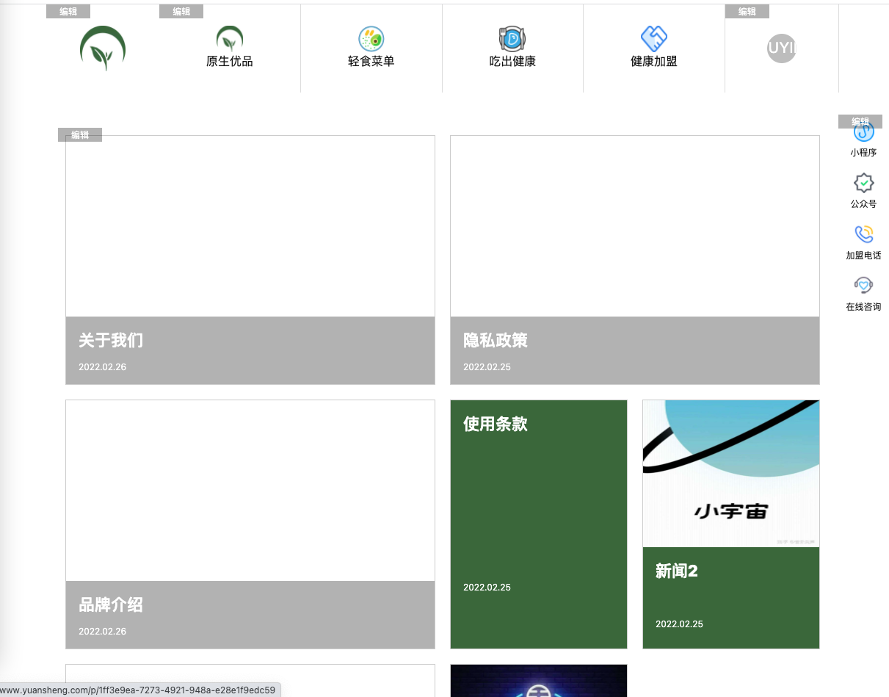
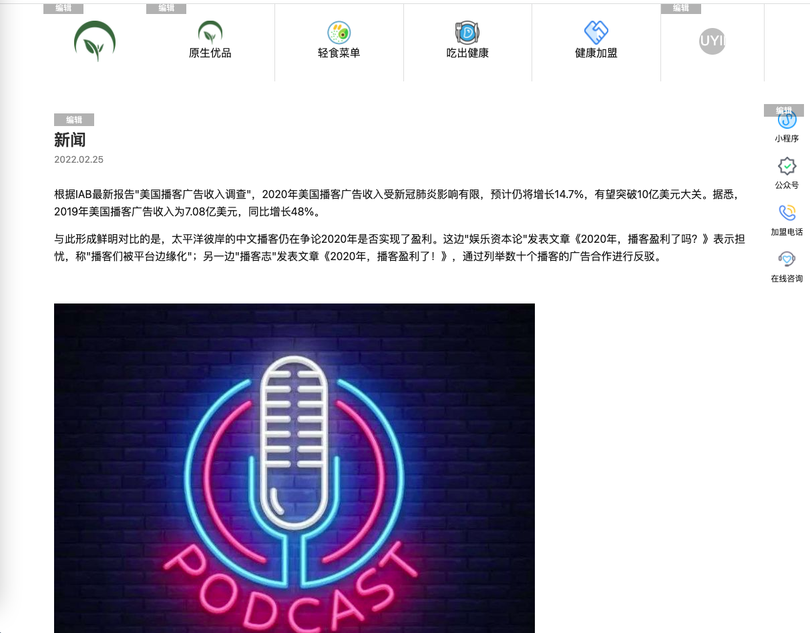
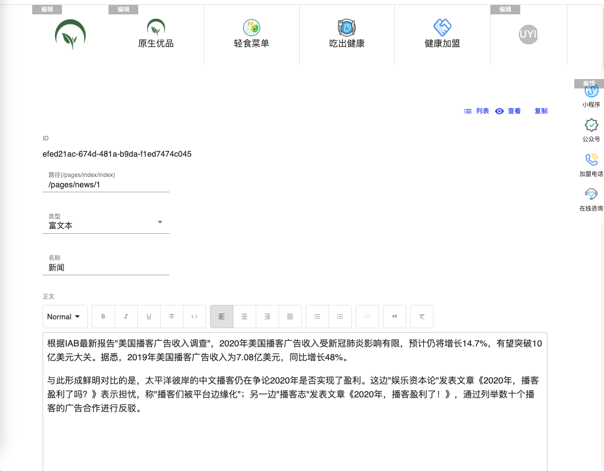

# Nextjs and Qiankun 实现官网

### 项目框架
- [nextjs](https://nextjs.org/)
- [qiankun](https://qiankun.umijs.org/)
- [swr](https://swr.vercel.app/zh-CN)

- [iconfont](https://www.iconfont.cn/)

### 项目功能预览

首页编辑

富文本页编辑

导航配置页面

富文本配置页面

